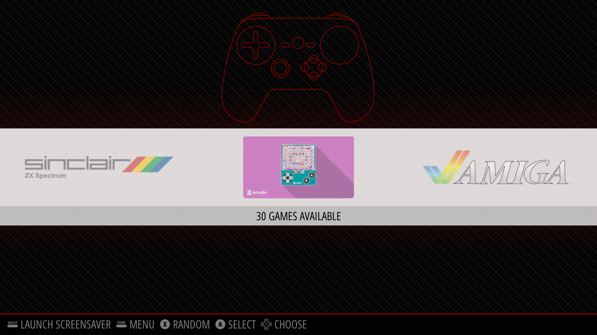
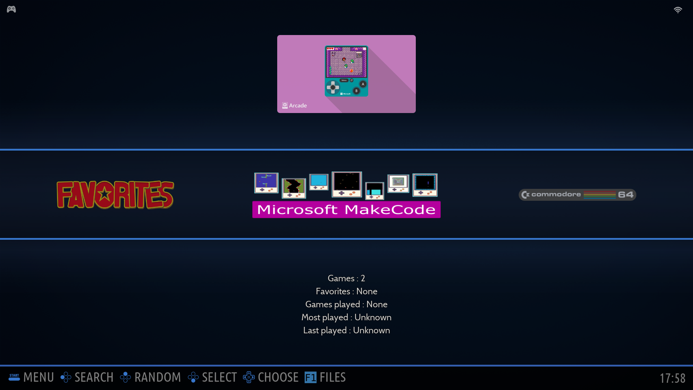
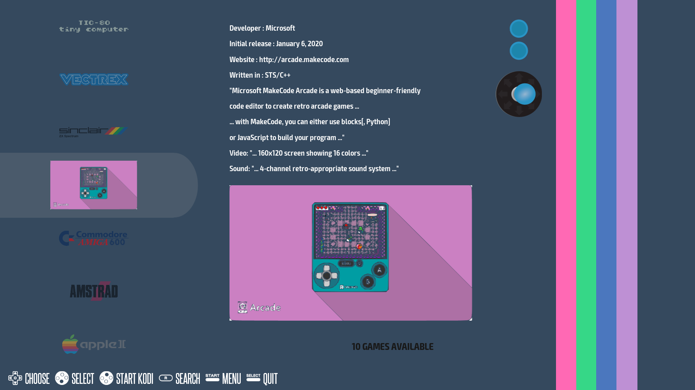
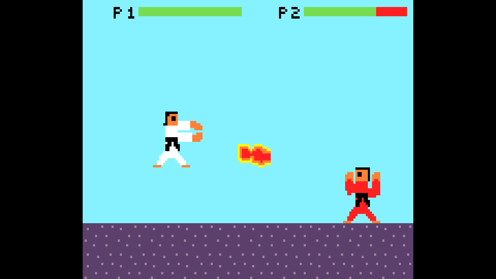

# NB! Installation scripts not working at the moment, BRB... Sorry!
# McAirpos
[MakeCode Arcade](https://arcade.makecode.com?nolocalhub=1&hw=rpi&compile=rawELF) games in [RetroPie](https://retropie.org.uk), [Recalbox 8/7](https://www.recalbox.com) and [Batocera](https://batocera.org), running natively as ELF executables on [Raspberry Pi OS](https://www.raspberrypi.com/software/)/Linux ARM with gamepad and keyboard support for up to 2 players.<br>

| | | |
|:-------------------------:|:-------------------------:|:-------------------------:|
|[](https://github.com/Vegz78/McAirpos/blob/master/docs/MakeCode_Arcade_RetroPie.png?raw=true)|[](https://github.com/Vegz78/McAirpos/blob/master/docs/MakeCode_Arcade_Batocera.png?raw=true)|[](https://github.com/Vegz78/McAirpos/blob/master/docs/MakeCode_Arcade_Recalbox.png?raw=true)|
|RetroPie|Batocera|Recalbox|
||(In-game screenshots provided by [retro2png](https://github.com/Vegz78/retro2png))||

Many thanks to [@willmtemple](https://github.com/willmtemple), [@mmoskal](https://github.com/mmoskal) and [@pelikhan](https://github.com/pelikhan) for all their help and support, and lately [@rdmueller](https://github.com/rdmueller) and [@edthedev](https://github.com/edthedev) for their contributions. Special thanks to [@hobbitalastair](https://github.com/hobbitalastair), [@MerlijnWajer](https://github.com/MerlijnWajer) and [@freethinker](https://github.com/freethinker), whose projects, [termfix](https://github.com/hobbitalastair/termfix), [uinput-mapper](https://github.com/MerlijnWajer/uinput-mapper) and [ttyecho](https://github.com/Vegz78/McAirpos/tree/master/McAirpos/ttyecho), I have used in my solution!!!<br>

[2022.06.15: Batocera 34 support and installation script](https://github.com/Vegz78/McAirpos#quick-automatic-installation-for-batocera)<br>
[2022.06.05: FINALLY the ](https://github.com/microsoft/pxt-arcade/issues/3812#issuecomment-1137197195)[_settings namespace/extension_](https://forum.makecode.com/t/quick-tutorial-on-the-settings-namespace/1013)[ has been fixed for Raspberry Pi/ARM](https://github.com/microsoft/pxt-arcade/issues/3812#issuecomment-1137197195)[, by @nopid!](https://github.com/nopid)<br>
[2022.05.31: Two new Ansible playbooks for installing McAirpos on multiple Recalbox 8 devices at once](https://github.com/Vegz78/McAirpos/blob/master/ansible)<br>
[2021.12.18: Recalbox 8 support and installation scripts](https://github.com/Vegz78/McAirpos#quick-automatic-installation-for-recalbox) and [Python 3.x support for uinput-mapper and major revision of launCharc](https://github.com/Vegz78/McAirpos#development-news)<br>
[2021.06.29: Updated controller configuration section in README.md](https://github.com/Vegz78/McAirpos#default-and-modifying-the-layout-for-controls)<br>
[2021.01.26: New quick installation script for RetroPie/RPi OS](https://github.com/Vegz78/McAirpos#installation)

Controller support out-of-the-box, tested ok with various combinations of:
- [PS3 controller](https://www.sony.com/sna/EN/graphics/info/pairps-psbutton.gif)
- [XBox One controller](https://img-prod-cms-rt-microsoft-com.akamaized.net/cms/api/am/imageFileData/RE1rfiZ?ver=03f2&q=90&m=6&h=705&w=1253&b=%23FFF0F0F0&f=jpg&o=f&p=140&aim=true)
- [SteelSeries Nimbus](https://www.techradar.com/reviews/steelseries-nimbus) (remember to set _invertUp_ to 1 in the _arcadeX.py_ files to invert the Y-axis)
- [retro-bit controller](https://translate.google.com/translate?sl=no&tl=en&u=https://cdon.no/spill/retro-bit-nes-usb-controller-41757027)
- [8BitDo N30 Pro 2 controller](https://translate.google.com/translate?sl=no&tl=en&u=https://retrospill.ninja/2020/08/8bitdo-n30-pro-2/)
- [EG STARTS 2 Player Arcade Joystick](https://www.amazon.com/EG-STARTS-Joystick-American-Raspberry/dp/B07P5BVSYK) (thanks for [testing](https://github.com/Vegz78/McAirpos/issues/6#issuecomment-762341565), [@lars-derichter](https://github.com/lars-derichter)!)
- [Hori Pokken Tournament DX Pro](https://translate.google.com/translate?sl=no&tl=en&u=https://retrospill.ninja/2018/11/hori-pokken-tournament-dx-pro-pad/) (thanks for testing, [@Gauteweb](https://github.com/Gauteweb)!)
- [Juyao 2 DIY USB](https://es.dhgate.com/product/for-4-8-connector-juyao-2-players-pc-ps-3/387652783.html) (thanks for [testing](https://github.com/Vegz78/McAirpos/issues/9), [@claricerogue](https://github.com/claricerogue)!)
- [SJ@JX Arcade DIY USB](https://www.amazon.ca/gp/product/B07FZ3YT1G) (thanks for [testing](https://github.com/Vegz78/McAirpos/issues/10#issuecomment-846587751) and [proposed solution to USB sound problems](https://github.com/Vegz78/McAirpos/issues/11), [@QuadDam](https://github.com/QuadDam)!)
- [Zero Delay Encoder DIY USB](https://www.electrokit.com/uploads/productfile/41017/SBC-ZDE-Datasheet.pdf) (thanks for [testing](https://github.com/Vegz78/McAirpos/issues/15#issuecomment-872328078), [@sofiania](https://github.com/sofiania)!)
- [GamePi20 handheld](https://www.waveshare.com/gamepi20.htm) (thanks for [testing](https://github.com/Vegz78/McAirpos/issues/18#issuecomment-889184610), [@marjian88](https://github.com/marjian88)!)
- [Picade DIY Arcade](https://shop.pimoroni.com/products/picade) (thanks for [testing](https://github.com/Vegz78/McAirpos/issues/22#issuecomment-911939494), [@rdmueller](https://github.com/rdmueller)!)
- [Retroflag GPi handheld](https://www.retroflag.com/GPi-CASE.html) (thanks for [testing](https://github.com/Vegz78/McAirpos/issues/28), [@rdmueller](https://github.com/rdmueller)!)
- [Mars Devices SNES USB controller](https://www.newegg.com/p/0V7-00D0-00011) (thanks for [testing](https://github.com/Vegz78/McAirpos/issues/39#issuecomment-1117715837), [@RecycledMonkey](https://github.com/RecyledMonkey)!)

It should also work with other controllers with little or no modification of the uinput-mapper [_arcadeX.py_ config files](https://github.com/Vegz78/McAirpos#default-and-modifying-the-layout-for-controls). 

Feedback is valueable, so please don't hesitate to [open an issue here](https://github.com/Vegz78/McAirpos/issues) for sharing with the community about other controllers that work and how, or if [something doesn't work for you](https://github.com/Vegz78/McAirpos#issues).

Please scroll down this page or click the following links for: [Downloading game files](https://vegz78.github.io/McAirpos), [Contents](https://github.com/Vegz78/McAirpos#contents), [Features](https://github.com/Vegz78/McAirpos#features), [Why McAirpos?](https://github.com/Vegz78/McAirpos#why-the-need-for-mcairpos), [Prerequisites](https://github.com/Vegz78/McAirpos#prerequisites), [Installation](https://github.com/Vegz78/McAirpos#Installation), [Updates](https://github.com/Vegz78/McAirpos#Updating), [Usage](https://github.com/Vegz78/McAirpos#Usage), [Controller layout and configuration](https://github.com/Vegz78/McAirpos#default-and-modifying-the-layout-for-controls), [Developement news](https://github.com/Vegz78/McAirpos#development-news), [Issues](https://github.com/Vegz78/McAirpos#issues), [Todo list](https://github.com/Vegz78/McAirpos#todo), [Mentions](https://github.com/Vegz78/McAirpos#Mentions) and [Retro gaming](https://translate.google.com/translate?sl=auto&tl=en&u=https://retrospill.ninja).
<br>

**Happy retro gaming and retro game making!!!**<br><br>
[@Vegz78](https://github.com/Vegz78)<br>
(Thank you for awarding McAirpos a star if you like and use it!)<br>
(If you're interested in retro gaming in general, please also check out the blog, [retrospill.ninja](https://translate.google.com/translate?sl=auto&tl=en&u=https://retrospill.ninja))<br>
[](https://github.com/Vegz78/McAirpos/blob/master/docs/MakeCode_Arcade_RetroPie.gif?raw=true)

## Make your own or dowload MakeCode Arcade games for RetroPie
I've made a solution for making [MakeCode Arcade](https://arcade.makecode.com?nolocalhub=1&hw=rpi&compile=rawELF) ready for downloading native executables of games here:<br>
https://vegz78.github.io/McAirpos

Either make your own games and extensions in the MakeCode web editor, or download from various places, like:

- [MakeCode Arcade home (https://arcade.makecode.com)](https://arcade.makecode.com?nolocalhub=1&hw=rpi&compile=rawELF)
- [MakeCode's official forum](https://forum.makecode.com/tag/game?order=posts)
- [itch.io](https://itch.io) (search for MakeCode Arcade game jams)
- [Here on GitHub](https://github.com/search?q=makecode+arcade+game&type=Repositories)
- [@Jacob](https://github.com/jacobcarpenter)['s games gallery](https://games-gallery.jacobcarpenter.com)
- [@UnsignedArduino](https://github.com/UnsignedArduino)['s Awesome-Arcade-Extensions](https://github.com/UnsignedArduino/Awesome-Arcade-Extensions)
- Other suggestions where to find good MakeCode Arcade games and resources?

[](https://github.com/Vegz78/McAirpos/blob/master/docs/MakeCode_Arcade_Raspberry_Pi.png?raw=true)
## Contents
- [Tool for setting the MakeCode Arcade editor in native executable mode for downloading executables](https://vegz78.github.io/McAirpos)
- A game launcher, [_launCharc_](https://github.com/Vegz78/McAirpos/tree/master/McAirpos/launCharc), for:
  - keeping the game in the foreground in RetroPie, 
  - cleaning up the terminal on exit, 
  - automatically detecting and setting up gamepad and keyboard controls
- [uinput-mapper](https://github.com/MerlijnWajer/uinput-mapper) to map gamepad inputs to the keyboard 

## Features
- Launch and exit natively executable MakeCode Arcade games gracefully from RetroPie and the Raspberry Pi OS console
- Autodetect gamepad and keyboard controls for up to 2 players
- [Easily download and ready the editor for natively executable game files](https://vegz78.github.io/McAirpos)

## Why the need for McAirpos?
The current MakeCode Arcade natively executable game files compiled with the Raspberry Pi as target have 2 problems preventing a nice experience from within RetroPie:
- The parent game process ID shifts during game play, which makes RetroPie think the game has exited and then puts it still running in the background. On exit, the game files do not release and clean up the framebuffer and key inputs, giving the impression that the system has frozen/halted.<br>
https://github.com/microsoft/pxt-arcade/issues/2435
- The game files natively do not support most newer [EV_ABS type](https://www.kernel.org/doc/Documentation/input/event-codes.txt) or multiple game controllers, but only 1 [EV_KEY type](https://www.kernel.org/doc/Documentation/input/event-codes.txt) gamepad or 1 keyboard input event, even though multiple players are supported in the games.<br>
https://github.com/microsoft/pxt-arcade/issues/2245

McAirpos works around both these issues, making MakeCode Arcade games play like other games in RetroPie.

## Prerequisites
- Git (```sudo apt install git```) or wget
- Drivers for gamepads you have that don't work "out of the box"
- [ALSA sound driver](https://forum.makecode.com/t/how-to-launch-makecode-arcade-uf2s-in-raspbian-retropie/2725/2)

## Installation
### Quick automatic installation for RetroPie/RPi OS
Run this command without sudo in a terminal or the CLI on RetroPie/RPi OS:<br>
```curl -sL https://raw.githubusercontent.com/Vegz78/McAirpos/master/install.sh | bash -```

Or clone the repository like in the 1st manual installation point below and run:<br>
```~/McAirpos/install.sh```

### Manual installation for RetroPie/RPi OS
1. Clone this repo from and into _/home/pi/_:<br>
```git clone https://github.com/Vegz78/McAirpos.git```<br>
_(Paths are currently hardcoded and will only work with the repo directly under /home/pi/)_
2. Copy the folder _.../MakeCode/sd_ with all its contents into the root folder _/_:<br>
```sudo cp -r ~/McAirpos/McAirpos/MakeCode/sd /```<br>
_(The game files are hardcoded to write to and read from this root/sd folder)_
3. Make sure the contents of _/sd_ are owned and writable for your user(normally _pi_):<br>
From _/_: ```sudo chown -R pi /sd&&sudo chgrp -R pi /sd&&sudo chmod -R 755 /sd```
4. Copy the _contents_ of the file _./McAirpos/EmulationStation/es_systems.cfg_MakeCode_ into the end of the file _/etc/emulationstation/es_systems.cfg_. Make sure not to delete the _\</systemList\>_ tag at the end of the file.
5. Copy the folder _./McAirpos/EmulationStation/makecode_ with all its contens into _/etc/emulationstation/themes/carbon/_.<br>
```sudo cp -r ~/McAirpos/McAirpos/EmulationStation/makecode /etc/emulationstation/themes/carbon```
6. Create a _makecode_ games folder under _/home/pi/RetroPie/roms/_ and [fill it up with native MakeCode Arcade games](https://vegz78.github.io/McAirpos).<br>
Make sure that the _makecode_ games folder is owned by _pi_ and has the correct permissions:<br>
```sudo chown -R pi:pi ~/RetroPie/roms/makecode&&sudo chmod -R 755 ~/RetroPie/roms/makecode```<br>
Also, **make sure that every _game\_file.elf_ has executable permissions** if they aren't set automatically when copying them to the _makecode_ games folder:<br>
```sudo chmod -R 755 ~/RetroPie/roms/makecode```

### Manual installation for Recalbox and Batocera
Please use the automatic installation scripts below.
If you still want to do a manual installation, access the script files and follow the instructions inside. :-)

### Quick automatic installation for Recalbox
To install McAirpos on your Recalbox, you will need shell access (Linux console) to it.
If you have a keyboard connected, you can enter the shell by pressing F4 + ALT+F2.
Otherwise, connect your Recalbox to the network (cable or WiFi), start a terminal on your PC and execute `ssh root@recalbox`.
The name `recalbox` might be different (for a GPi Case, it is `ssh root@recalboxgpi`). 
You can lookup the correct name in the network settings of your Recalbox or use the IP address.
Default User/Pass: root/recalboxroot

Run _one_ of these commands from the shell:<br>
<br>Recalbox 8 with jack or usb audio:<br>
```curl -sL https://raw.githubusercontent.com/Vegz78/McAirpos/master/install_recalbox_v8.sh | bash -```<br>
(if you experience nuisance where audio switches to HDMI after exit of MakeCode Arcade games, [please see here for a workaround...](https://github.com/Vegz78/McAirpos/issues/39#issuecomment-1121534032))<br>
<br>Recalbox 8 with HDMI audio:<br>
```curl -sL https://raw.githubusercontent.com/Vegz78/McAirpos/master/install_recalbox_v8_HDMI-Audio-Fix.sh | bash -```<br>
<br>Recalbox 7-Reloaded!:<br>
```curl -sL https://raw.githubusercontent.com/Vegz78/McAirpos/master/install_recalbox_v7.sh | bash -```<br>

If you don't know which script to use, start with updating your Recalbox and the `v8` script.
If you run into problems with the sound, try the `v8_HDMI-Audio-Fix` script below, or the general [HDM-Audio-Fix](https://github.com/Vegz78/McAirpos#missing-hdmi-audio-in-makecode-arcade-games) script for Linux kernels >= v.5.

After running the script, there will be a "makecode" roms folder. 
Copy your .elf files (generate through https://vegz78.github.io/McAirpos/) to this folder via scp, directly to your card or SMB mount for MakeCode Arcade to appear as an emulator in the Recalbox main menu after the next reboot.

### Installation on multiple Recalbox devices
For RecalBox 8, two [Ansible playbooks](/ansible/) are available for installing McAirpos remotely to multiple devices at once. This is well suited for classroom or makerspace settings with many simultaneous programming and arcade projects.<br>

### Quick automatic installation for Batocera
To install McAirpos on Batocera, you will need shell access (Linux console).
If you have a keyboard connected, you can enter the shell by pressing CTRL+ALT+F5.
Otherwise, connect your Batocera device to the network (cable or WiFi), start a terminal on your PC and execute `ssh root@batocera`. 
You can lookup the correct name in the network settings of your Recalbox or use the IP address.
Default User/Pass: root/linux

Run this command from the shell:<br>
```curl -sL https://raw.githubusercontent.com/Vegz78/McAirpos/master/install_batocera.sh | bash -```<br>

### Missing HDMI audio in MakeCode Arcade games
For Linux kernels >= v.5 (newer RetroPie, Recalbox and Raspberry Pi OS releases, check with `uname -a`) there is [a problem where HDMI audio is not found, as required by MCA games, on the first ALSA audio device, _hw:0,0_](https://github.com/Vegz78/McAirpos/issues/27#issuecomment-1122227034), and MakeCode Arcade games either crash, freeze or play without sound. To resolve this on a recently updated McAirpos installation, run this script:<br>
```curl -sL https://raw.githubusercontent.com/Vegz78/McAirpos/master/HDMI-Audio-Fix.sh | bash -```<br>
Batocera does not seem to have this problem, since audo is handled by [Pipewire](https://pipewire.org).

### SSL certificate error
On some systems, you might get an SSL certificate error when running the `curl` commands. Then try one of these commands instead:
[https://github.com/Vegz78/McAirpos/issues/41#issuecomment-1156973597](https://github.com/Vegz78/McAirpos/issues/41#issuecomment-1156973597)

## Updating
Bugfixes, changes and additions are released sporadically as updates to the main branch, without any formal system for releases and history. News about the latest and most important updates are published with dates in the [development section](https://github.com/Vegz78/McAirpos#development-news), with links to further details in the commit comments. 

Updates to included files located outside the _~/home/pi/McAirpos_ are seldomly expected, so to update, from inside this folder, simply type: ```git pull```

Alternatively, if you've made changes to any of the files in this folder, simply back up those files, and then remove the folder and clone again, from _/home/pi_: ```rm -rf ./McAirpos&&git clone https://github.com/Vegz78/McAirpos.git```

## Usage
- Fire up EmulationStation and navigate to your MakeCode Arcade games menu and select the game to play, or
- Run from the text console(games do not run within X):<br>
```~/McAirpos/McAirpos/launCharc/launCharc ~/RetroPie/roms/makecode/_gamefile.elf_```

  - <a id="nomap-option"></a>```nomap``` command line option for manual configuration of 1 keyboard(2 players) or 1 [EV_KEY type](https://www.kernel.org/doc/Documentation/input/event-codes.txt) gamepad interface(e.g. GPIO with 1 or more controllers/players) using the _/sd/arcade.cfg_ file directly without running uinput-mapper:<br>
```~/McAirpos/McAirpos/launCharc/launCharc nomap ~/RetroPie/roms/makecode/_gamefile.elf_```<br> and similarly inside _/etc/emulationstation/es_systems.cfg_.
  - ```keybswap``` command line option for swapping from the lowest(default) autodiscovered keyboard input handler to the highest, if your keyboard is not detected correctly.
  - ```verbose``` command line option for verbose logging to stdout instead of _/tmp/McAirpos.log_.

**NB: The _game\_files.elf_ and launCharc only work in RetroPie(booted directly into or started from the CLI) and in the [Linux console/CLI](https://en.wikipedia.org/wiki/Linux_console). They do not work(cannot open gfx display) when run in a terminal emulator or in RetroPie started from within a desktop/gui/X environment.**

**NB2: [The _game\_files.elf_ must be executable and the _~/RetroPie/roms/makecode_ folder must be writable:](https://github.com/Vegz78/McAirpos/issues/13#issuecomment-866690857)**<br>
```sudo chmod -R 755 ~/RetroPie/roms/makecode```<br>
Typical symptoms when this is not the case, are games not launching with only a black screen and _/tmp/McAirpos.log_ showing "Did not find the file /tmp/pxt-pid..." and/or "Timed out trying to find game's process ID..." after having tried to launch a game.

If something goes wrong and the screen/keyboard freezes inside the game, it should be possible to regain control of the console/RetroPie by a combination of _CTRL+\\, CTRL+C, CTRL+D and CTRL+C_.

## Default and modifying the layout for controls
### Default button mappings with corresponding EV_ABS and (EV_KEY) _codes*_:
|Move|Keyboard PL1|Keyboard PL2|Gamepads/Controllers PL1&PL2|
|:---|:-------|:--------|:--------|
|Up  |W (17)  |Up arrow (103)|BTN_DPAD_UP /-ABS_HAT0Y /-ABS_Y** (17/103)|
|Down|S (31)  |Down arrow (108)|BTN_DPAD_DOWN /ABS_HAT0Y /ABS_Y (31/108)|
|Left|A (30)  |Left arrow (105)|BTN_DPAD_LEFT /-ABS_HAT0X /-ABS_X (30/105)|
|Right|D (32) |Right arrow (106)|BTN_DPAD_RIGHT /ABS_HAT0X /ABS_X (32/106)|
|Fire/A|Left Ctrl (29)|Right ALT (100)|BTN_SOUTH(/BTN_A) /BTN_THUMB (29/100)|
|Fire2/B|Left Shift (42)|Space bar (57)|BTN_EAST(/BTN_B) /BTN_THUMB2 (42/57)|
|Exit|Esc (1)||BTN_START /BTN_BASE4 /ABS_Z (1)|
|Restart|F1 (59)||BTN_SELECT /BTN_BASE3 /ABS_RZ (59)|
|Menu|F2 (60)||BTN_MODE(/BTN_PS) /KEY_HOMEPAGE (60)|
|||||
|*Code* type:|(EV_KEY)|(EV_KEY)|EV_ABS, and some EV_KEY(BTN_s) (EV_KEY1/E_VKEY2)|
|Mapping:|(Game-native)|(Game-native)|uinput-mapper to (game-native)|
|In files:|arcade.cfg|arcade.cfg|arcade1&2.py|
||||* (EV_KEY) *codes* in arcade.cfg and in the 'code' fields<br> in arcade1&2.py must always correspond.<br>** Negative EV_ABS values are values less than the <br>center value, positive are greater than center|

For many gamepads and controllers, there should be no or little need for modification of the config files. For [DIY Arcade controllers](https://www.google.com/search?q=diy+arcade+controllers&source=lmns&tbm=shop&bih=792&biw=1508), you might save some time and complexity by __*please checking that the physical wirings are correct*__ as a first step and before attempting to modify the config files.

Buttons in MakeCode Arcade games operate with raw input events on the lowest level - the Linux Input Subsystem. It's therefore often best to get your controllers to work correctly inside McAirpos first, and according to the most logic physical button function/location for every input event EV *code* name the controller outputs(The physical button intended for the 'fire' function, should typically output the EV *codes* BTN_SOUTH(/BTN_A) or BTN_THUMB, and not output BTN_SELECT etc.). When the buttons are correctly wired and set up in McAirpos, they can then easily be reconfigured accordingly inside RetroPie and other programs working with controllers on a higher level.

### Changing button layouts: 
- Edit [_/sd/arcade.cfg_](https://github.com/Vegz78/McAirpos/blob/master/McAirpos/MakeCode/sd/arcade.cfg) for keyboard(or [EV_KEY type](https://www.kernel.org/doc/Documentation/input/event-codes.txt) gamepads, where all *values* are either 0 or 1), or
- Edit the uinput mapping files [_arcade1.py_](https://github.com/Vegz78/McAirpos/tree/master/McAirpos/uinput-mapper/configs) for only 1 controller, and both _arcade1.py_ and _arcade2.py_ under _~/McAirpos/McAirpos/uinput-mapper/configs/_ for 2 [EV_ABS type](https://www.kernel.org/doc/Documentation/input/event-codes.txt) gamepads/controllers*<br>
(where most commonly only the joystick has EV_ABS *values* that vary typically somewhere between -256 and 256 along each axis).

<br><a id="ev_abs-controller">When using EV_ABS type gamepads/controllers(most common case for USB/BT interfaces) with uinput-mapper, please:
1. Leave */sd/arcade.cfg* alone/as-is
2. Check and take note of **all** the EV *codes* and *values* that your controller outputs for each button and joystick direction with [`evtest`](https://github.com/Vegz78/McAirpos#evtest-readout)
3. *Physically (re-)wire* the real button with its intended function(e.g. *Exit*) so that `evtest` outputs one of the *codes* in the rightmost column of the same row as this function in the table above, if possible
4. If not possible to rewire or the controller does not output all of those codes accordingly or uniquely, edit _arcade1&2.py_ so that each button's or joystick direction's EV_KEY or EV_ABS *code* is included and corresponds/is mapped to the same (EV_KEY) *code* as in _/sd/arcade.cfg_, for its intended function**  <br><br>

<a id="ev_key-controllers">When using EV_KEY type key gamepads/controllers(most common case for keyboards and GPIO interfaces) with only **one** _/dev/input/eventX_ and without the need for uinput-mapper, please:
1. Check and take note of **all** the EV_KEY *codes* that your controller outputs for each button and joystick direction with [`evtest`](https://github.com/Vegz78/McAirpos#evtest-readout)
2. Edit only */sd/arcade.cfg* with the correct _/dev/input/eventX_ number and (EV_KEY) _code_ mappings corresponding to the physical wiring  
  (This is explained much better and in detail [here](https://arcade.makecode.com/hardware/raspberry-pi/cardboard-control-panel/assemble) and [here](https://learn.adafruit.com/makecode-arcade-with-raspberry-pi-zero/firmware#custom-inputs-3015722-7))
3. Run `launCharc` with the [`nomap`](https://github.com/Vegz78/McAirpos#nomap-option) argument  <br><br>


### Finding your controller's input eventX number and the EV *codes* and *values* that its buttons and joystick outputs:
1. <a id="evtest-readout"></a>Find your gamepad's _/dev/input/eventX number_: ```more /proc/bus/input/devices```
2. Read out all the gamepad's registered button names and types, and test to which button name each physical button is mapped by running: ```evtest /dev/input/eventX```, where X is the input number found in the first point. Exit _evtest_ with CTRL+C.

### Optimizing controller performance
In an attempt to maximize the number of game controllers supported, McAirpos runs a self-calibrating routine on every launch of a game and has a few redundant uinput mappings. 

Even though it has been reported to run all right even on a Raspberry Pi Zero, if you experience an occasional choppiness during gameplay or hangs in either direction(before max stroke in all directions is read), and if you are technically inclined to optimize, you can:
- [remove the button and directional mappings that are redundant](https://github.com/Vegz78/McAirpos/blob/03a88f802ca0939b253b196eb65b931301887831/McAirpos/uinput-mapper/configs/arcade1.py#L197) for your controllers in _arcade1&2.py_, and
- [hardcode the _min_ and _max_ values](https://github.com/Vegz78/McAirpos/blob/03a88f802ca0939b253b196eb65b931301887831/McAirpos/uinput-mapper/configs/arcade1.py#L25) according the evtest readout above for your gamepad.<br><br>


(*Theoretically, it should be possible with [up to *4* players/controllers on the RPi](https://github.com/microsoft/pxt-arcade/pull/1139), but this is most feasible with 4 EV_KEY controls game-natively on the same input event(GPIO/Keyboard?) in *arcade.cfg*. Setting up this automatically with uinput-mapper for 4 EV_ABS controllers, proved hard du do(4 *arcade.py with **lots** of mappings etc.), and all the cross-mappings in uinput-mapper would probably put to much strain on the RPi, unless all redundant mappings are removed and the auto calibration routine is hard-coded with the correct EV_ABS *value* ranges instead. Then, maybe it would be possible with a fixed setup, where all controllers are always on and on the same input event.)

(**If you have any great working and optimized uinput-mapper _arcade1&2.py_ controller configurations, please share them for others' to use, by uploading the file to an issue for the same controller type in the issues section!)

## Issues
Don't hesitate to [open an issue](https://github.com/Vegz78/McAirpos/issues) if it doesn't work as expected or you have suggestions for improvements. But please first:
1. Read the [usage section](https://github.com/Vegz78/McAirpos#Usage) *thoroughly*, and
2. **Check and double-check** that your [*game_files.elf* are **executable** and that your games folder is **writable**](https://github.com/Vegz78/McAirpos/issues/13#issuecomment-866690857):<br>
```sudo chmod -R 755 ~/RetroPie/roms/makecode```, and
3. Check the physical wiring of DIY Arcade controllers and whether [your issue might already have been solved](https://github.com/Vegz78/McAirpos/issues?q=is%3Aissue+is%3Aclosed), and
4. *If your game is still not launching*, provide a copy of */tmp/McAirpos.log*, or
5. *If your controller is still not working*, provide an [_evtest_ readout of your controller](https://github.com/Vegz78/McAirpos#evtest-readout) with indications about which button functions you intend for which listed input events<br>

I'm still just learning to code and I don't mind a little [spaghetti code](https://en.wikipedia.org/wiki/Spaghetti_code) as long as it just works.. ;-)<br>

I would really appreciate feedbacks from your own experiences with McAirpos and maybe pick up some tricks of the trade while we sort out the bugs together!

## Development news
[**2022.06.15:**](https://github.com/Vegz78/McAirpos/commit/4c5e06b290d19f07ad9a32fa7d9cc7b11f824fa3) Added Batocera 34 support and installation script.<br>
[**2022.05.31:**](https://github.com/Vegz78/McAirpos/commit/819c6dc8a077c09660d681edea18161074aba016) Added Ansible deployment playbooks for Recalbox 8 to enable installation on multiple devices at once.<br>
[**2021.12.18:**](https://github.com/Vegz78/McAirpos/commit/6e44f74b150ef48080533103e9bbebcb17321e8f) New automatic installation scripts for McAirpos on Recalbox 8 - one for analog/jack audio and one for HDMI audio. [Larger refactoring and bug fixes of the launCharc launcher](https://github.com/Vegz78/McAirpos/commit/22ec726494376ea68551cbc0dc4b8eac1692ad39) and some more bugfixes.<br>
[**2021.12.16:**](https://github.com/Vegz78/McAirpos/commit/b3caca09a71e2c5f4e131a6593a5c7fa232f0ccc) Added McAirpos support for Recalbox 8, including Python 3.x support in addition to 2.7 for uinput-mapper, fix for broken HDMI alsa audio in MCA games and testing and verifying support for the Retroflag GPi case controller. Thank you very much, [@rdmueller](https://github.com/rdmueller), for testing changes and the GPi controller, and contributing to solutions!<br>
[**2021.07.13:**](https://github.com/Vegz78/McAirpos/issues/17#issuecomment-879092813) Tested McAirpos running ok with keyboard and gamepad controllers on fresh RetroPie 4/400 image, v4.7.1(buster, kernel 5.4.72).<br>
[**2021.07.06:**](https://github.com/Vegz78/McAirpos/commit/03a88f802ca0939b253b196eb65b931301887831) Major revision of the _arcade1&2.py_ controller configuration files.<br>
[**2021.06.29:**](https://github.com/Vegz78/McAirpos#default-and-modifying-the-layout-for-controls) Updated controller configuration section in README.md.<br>
[**2021.02.02:**](https://github.com/Vegz78/McAirpos/commit/e1ab57e3f52b4646d7e1ee0352b41d141badd023) Added support and quick installation script for [*Recalbox 7.1.1-Reloaded!*](https://www.recalbox.com), only tested on a RPi4 4GB. Silent game launch with logging to /tmp/McAirpos.log instead of stdout, argument option ```verbose``` for old launch with text to screen. Some small fixes and cleanup of code.<br> 
[**2021.01.28:**](https://github.com/Vegz78/McAirpos/commit/e96e6cb0f3b8fe5f3fc011bf8522ac8cae0d9dde) Tested McAirpos running ok with keyboard and gamepad controllers on the following systems:<br>
-RPi4 B 4GB: RetroPie 4/400 image, v4.7.1(buster, kernel 5.4.72), RetroPie(FKMS ON), CLI(FKMS ON&OFF)<br>
-RPi4 B 4GB: RetroPie v4.7.3 on top of RPi OS(buster, kernel 4.19.97), RetroPie(FKMS ON), CLI(FKMS ON&OFF)<br>
-RPi3 B+/B: RetroPie 2/3 image, v4.7.1(buster, kernel 5.4.72), RetroPie(FKMS ON), CLI(FKMS ON&OFF)<br>
-RPi3 B+: RetroPie v4.7.3 on top of RPi OS(buster, kernel 5.4.83), RetroPie(FKMS ON), CLI(FKMS ON&OFF)<br>
-RPi3 B+: RetroPie v4.6 on top of RPi OS(stretch, kernel 4.19.66), RetroPie(FKMS OFF), CLI(FKMS ON&OFF)<br>
-RPi3 B: RetroPie 4.2.12 on top of RPi OS(jessie, kernel 4.9.35), RetroPie(FKMS OFF), CLI(FKMS ON&OFF)<br>
-RPi4 B 4GB, RPi3 B+/B: RPi OS Lite image 2020-12-02(buster, kernel 5.4.79), CLI(FKMS ON&OFF)<br>
[**2021.01.26:**](https://github.com/Vegz78/McAirpos#installation) Got tired of doing the manual installation procedure on all my test images and made a quick automatic installation script for everyone to use.<br>
[**2021.01.24:**](https://github.com/Vegz78/McAirpos/commit/c1350073bc3ba21be16c098a44f46469a3658fd4) Stability improvements for game launch and exit, more accurate keyboard autodiscovery, defaults to lowest keyboard input event handler, new ```keybswap``` command line option to swap to highest.<br>
[**2021.01.18:**](https://github.com/Vegz78/McAirpos/commit/932740f491cf1afede31578a6077f6ab5c2994f8) Bugfixes, improvements and further testing, most notably fixed the occasional mismatch of /dev/input/eventX between uinput-mapper and launCharc in /sd/arcade.cfg, and now possible to map 1 & 2 controllers without keyboard connected. Feedback about additional working controllers and about possible reasons for occasional instability/game exit, especially on older RPi devices and RPi OS/RetroPie distros, is still appreciated.<br>
[**2021.01.15:**](https://github.com/Vegz78/McAirpos/commit/fd8ac34ed5891ed8fa860b41d586f8fdc976a1aa) Added ```nomap``` option for manual configuration and use of _/sd/arcade.cfg_ directly for controllers, instead of auto-detection and uinput-mapper. With some great help from [@Kay-Wolfe](https://github.com/Kay-Wolfe), gamepad support is now expanded.

## Todo
Some thoughts and ideas I might start grappling with in the near or distant future. Don't hesitate to post good ideas in the issues section. If it's to big or difficult for me, maybe you want to contribute directly with a pull request?
- Follow up bugs and improve stability
- Expand gamepad support further
- Collect a library of well working controller configurations(Please share working _/sd/arcade.cfg_ and _arcade1&2.py_ files with the name and type of controllers in [the issues section](https://github.com/Vegz78/McAirpos/issues))
- ~~Silent start, verbose option and/or log file~~
- ~~Support and install script for RecalBox~~
- Attempt to include as scriptmodule in RetroPie-Setup and as an included system in Recalbox?(Going to be needing some help with this, anyone up to the task?)
- More command line options;
  - Specify wanted /dev/input/eventXs manually,
  - Incorporate/allow to connect via [other mapping apps/scripts](https://github.com/Vegz78/McAirpos/issues/5#issuecomment-760950633)
  - Try to [use some of the controller configurations already set up in RetroPie](https://github.com/Vegz78/McAirpos/issues/5#issuecomment-761888132)<br>
- Make more generic as a launcher for other games needing controller mapping?

## Mentions
- [The MakeCode Newsletter](http://makecode.adafruitdaily.com/monthly/2021/01/22/play-makecode-arcade-games-on-raspberry-pi.html)
- [MakeCode Arcade hardware pages](https://arcade.makecode.com/hardware/raspberry-pi)
- [Adafruit tweet](https://twitter.com/anne_engineer/status/1343675578701017088)
- [Microsoft tweet](https://twitter.com/kikivsit/status/1488682184957251584)
- [Nippon Online Homelab](https://inippon.com/makecode-arcade-retropie/)
- [JuegosRobotica.es](https://juegosrobotica.es/maquina-recreativa-makecode-arcade)
- [@mr_polsky tweet](https://twitter.com/mr_polsky/status/1356472105735397376)
- [@\_RobDominguez tweet](https://twitter.com/_RobDominguez/status/1347381575282012160)
